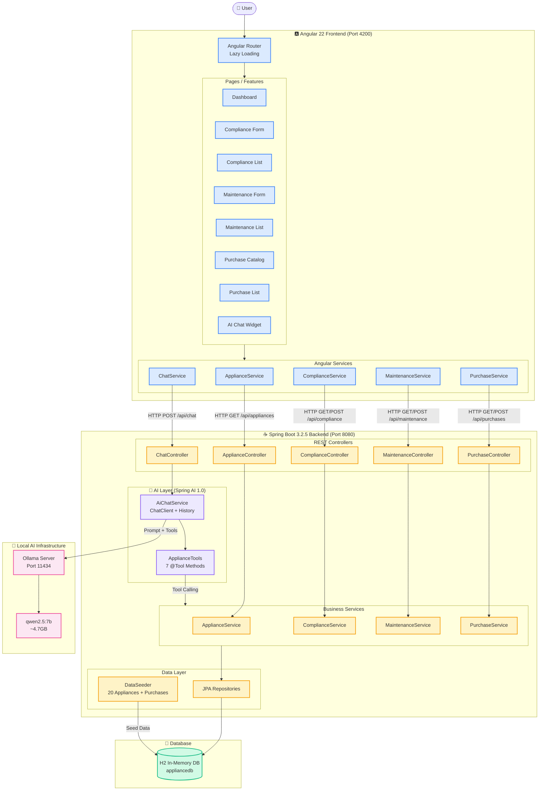
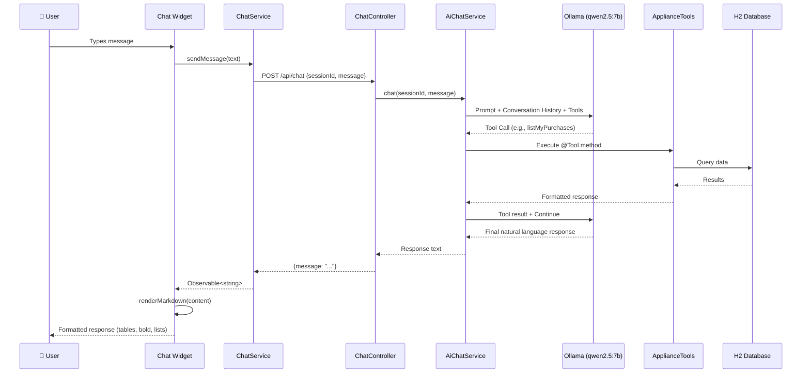

# Architecture Diagram

## Component Overview

| Layer | Technology | Responsibility |
|-------|-----------|----------------|
| **Frontend** | Angular 22 (Standalone, Signals) | UI, routing, state management |
| **REST API** | Spring Boot 3.2.5 | CRUD operations, validation |
| **AI Layer** | Spring AI 1.0 + Ollama | Natural language processing, tool calling |
| **Data** | Spring Data JPA + H2 | Persistence, seeding |
| **LLM** | Ollama + qwen2.5:7b | Local inference, function calling |

## Data Flow: AI Chat with Tool Calling

## Key Architectural Decisions

1. **Standalone Components** — No NgModules; each component declares its own imports.
2. **Signals for State** — Angular signals replace RxJS-based state management.
3. **Local LLM** — Ollama runs locally; no cloud API keys needed for the demo.
4. **Tool Calling** — Spring AI `@Tool` annotations let the LLM invoke backend services directly.
5. **In-Memory DB** — H2 resets on restart; `DataSeeder` provides consistent demo data.
6. **Markdown Rendering** — `marked` library renders AI responses with rich formatting.
